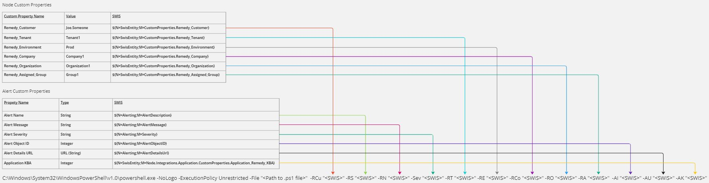
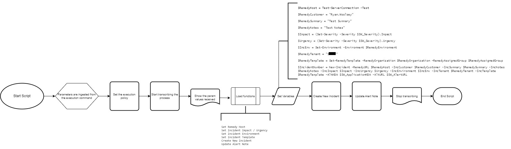
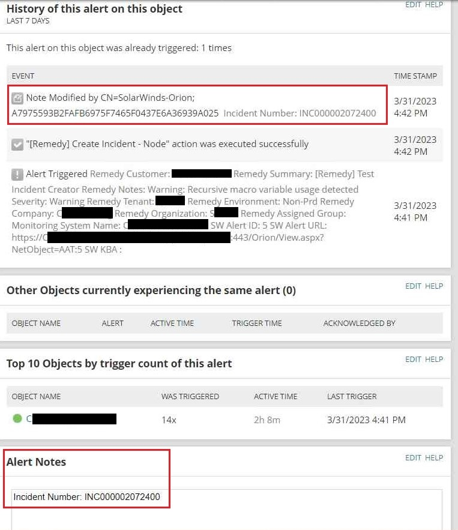
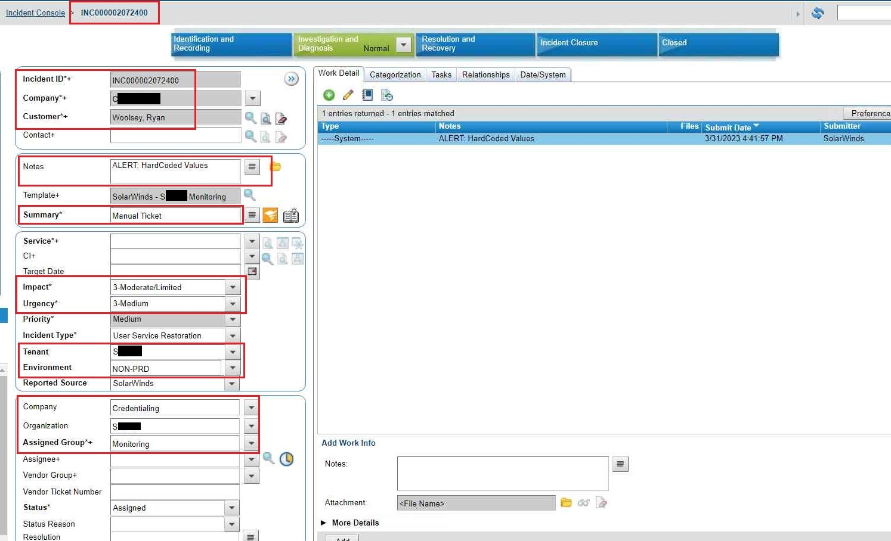

# SolarWinds Remedy Auto Incident Generator
Use SolarWinds alerts to automatically generate Remedy Incidents

### Problem
The Enterprise Operations Support Center monitored SolarWinds for alerts within the environment. 
When the alerts triggered, personel had to manually create corresponding Remedy incidents.
On occassions, there would be an overwhelming amount of alerts, alerts would not be noticed, or incidents had incorrect information.

### Solution
Execute a script on alerts that will create Remedy Incidents, populating the incidents with relative information.

### Goals
- Reduce human error recording
- Improve time to create incidents
- Catch alerts that clear quickly
- Facilitate tabular navigation for improved user experience

## Project status
Working

## Getting started
**This is written from a SolarWinds / PowerShell Admin, I am not a Remedy Admin and highly suggest you consult the Remedy Admins for clarity on that sides configuration**

## Visuals









## Installation

**SWIS PowerShell Module is required to be install on the SolarWinds server in order to work**

## Usage
The basic command to execute the script
```powershell
C:\Windows\System32\WindowsPowerShell\v1.0\powershell.exe -NoLogo -ExecutionPolicy Unrestricted -File "C:\RemedyAPI\SolarWindsConnector.ps1" -RemedyCustomer "${N=SwisEntity;M=CustomProperties.Remedy_Customer}" -RemedySummary "${N=Alerting;M=AlertDescription}" -RemedyNotes "${N=Alerting;M=AlertMessage}" -SW_Severity "${N=Alerting;M=Severity}" -RemedyTenant "${N=SwisEntity;M=CustomProperties.Remedy_Tenant}" -RemedyEnvironment "${N=SwisEntity;M=CustomProperties.Remedy_Environment}" -RemedyCompany "${N=SwisEntity;M=CustomProperties.Remedy_Company}" -RemedyOrganization "${N=SwisEntity;M=CustomProperties.Remedy_Organization}" -RemedyAssignedGroup "${N=SwisEntity;M=CustomProperties.Remedy_Assigned_Group}" -SW_AlertID "${N=Alerting;M=AlertObjectID}" -SW_AlertURL "${N=Alerting;M=AlertDetailsUrl}" -SW_ApplicationKBA "${N=SwisEntity;M=Integrations.Application.CustomProperties.Application_Remedy_KBA}"
```

### Trigger Generator
The execution command is very long and it's very easy to make a mistake in typing. 

## Support

## Roadmap
Add incident update after the alert resets

## Contributing
Any and all contribution is appreciated

## Authors and acknowledgment
Stephen Ferrari for starting this idea
Ryan Woolsey for the powershell contribution

## Resources
Links to any additional resources related to the project.

[Remedy AR System - REST API, how to use it with Powershell's Invoke-RestMethod Commands](https://community.bmc.com/s/article/Remedy-AR-System-REST-API-how-to-use-it-with-Powershell-s-Invoke-RestMethod-Commands)

[Overview of the Remedy REST API](https://docs.bmc.com/docs/ars2002/overview-of-the-rest-api-909638130.html)

[Create a Remedy Incident](http://depressedpress.com/2016/05/20/create-a-link-to-a-remedy-ticket/)
